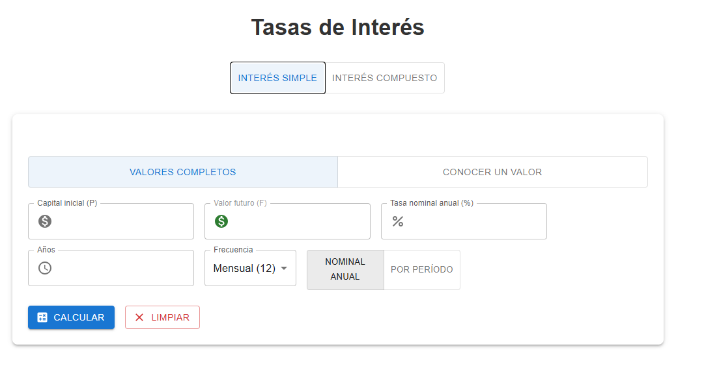
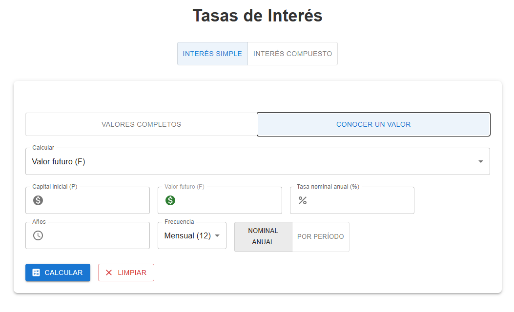
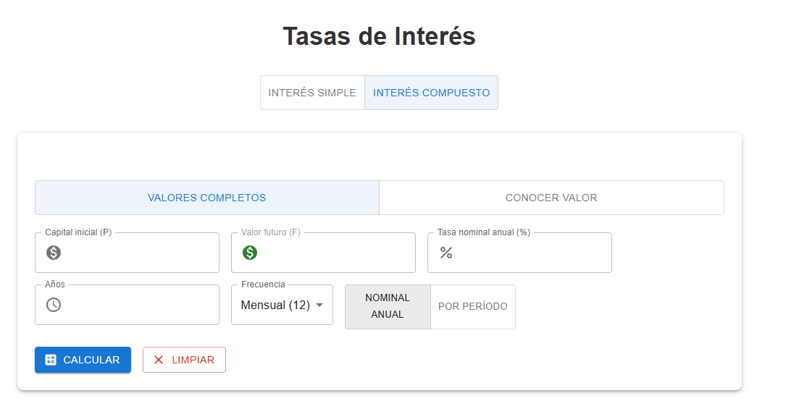
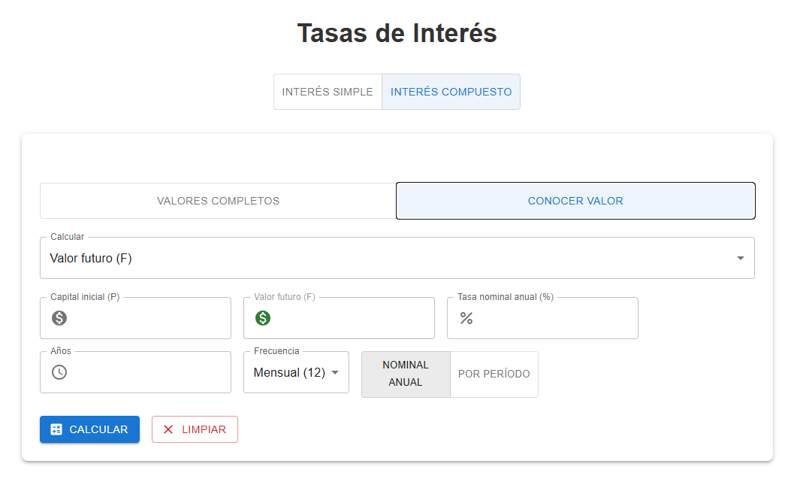

# Calculadora Financiera en React

Aplicación web interactiva para cálculos de **interés simple**, **interés compuesto** y **descuentos** (comercial, real, compuesto y equivalencia de tasas).


## Tecnologías utilizadas

- React 18 + Vite
- Material-UI (@mui/material + @mui/icons-material)
- CSS plano 

## Instalación paso a paso

```bash
# 1. Crear el proyecto con Vite + React
npx create-vite@latest calculadora-financiera -- --template react

# 2. Entrar a la carpeta del proyecto
cd calculadora-financiera

# 3. Instalar dependencias base de React/Vite
npm install

# 4. Instalar Material-UI (componentes visuales: tarjetas, botones, toggles, inputs)
npm install @mui/material @emotion/react @emotion/styled

# 5. Instalar los iconos de Material-UI (dinero 💰, porcentaje %, reloj ⏰, etc.)
npm install @mui/icons-material

# 6. Iniciar la aplicación en modo desarrollo
npm run dev

calculadora-financiera/
├── src/
│   ├── components/
│   │   ├── Sidebar.jsx          # Menú lateral
│   │   ├── Tasas.jsx            # Contenedor de tasas (elige simple/compuesto)
│   │   ├── TasasSimple.jsx      # Cálculos de interés simple
│   │   ├── TasasCompuestas.jsx  # Cálculos de interés compuesto
│   │   └── Descuentos.jsx       # Todos los tipos de descuento
│   ├── App.jsx                  # Componente principal + estado global
│   └── App.css                  # Estilos generales
├── public/                      # Archivos estáticos
└── docs/
    └── imagenes/                # Capturas de pantalla para documentación

    Vista rápida de los módulos

Sidebar: Menú lateral para navegar
Tasas de Interés: Interés simple y compuesto con múltiples incógnitas
Descuentos: Descuento comercial, real, compuesto y equivalencia i ↔ d


## Explicación detallada de los componentes

### 1. Sidebar.jsx – El menú lateral
**¿Qué hace?**  
Barra fija a la izquierda para cambiar entre módulos.

**¿Por qué está hecho así?**  
- Simple: usa `onClick` directo.  
- Diseño oscuro para contraste.

**Diagrama de flujo**

```mermaid
flowchart LR
    A[Usuario ve Sidebar] --> B[Clic en opción]
    B --> C[onClick llama setModulo]
    C --> D[App cambia estado]
    D --> E[Se muestra el módulo elegido]

    Captura de ejemplo

2. Tasas.jsx – Selector de tipo de interés
¿Qué hace?
Muestra título + toggle y decide qué cálculo mostrar.
¿Por qué ToggleButtonGroup?

Selección clara y moderna
Muestra visualmente cuál está activo

Diagrama de flujo

flowchart TD
    A[Usuario ve Tasas] --> B[ToggleButtonGroup]
    B --> C[elige Simple o Compuesto]
    C --> D[setTipo simple o compuesto]
    D --> E[Render condicional]
    E --> F[TasasSimple o TasasCompuestas]

    Capturas de ejemplo


3. TasasSimple.jsx – Interés Simple
Concepto clave
Interés lineal (solo sobre capital inicial).
Diagrama de flujo principal

flowchart TD
    A[Usuario llena datos] --> B[Presiona Calcular]
    B --> C[validarEntradas]
    C -->|error| D[muestra alerta]
    C -->|ok| E[calcular]
    E --> F[elige fórmula según modo]
    F --> G[muestra resultado + fórmula]

  **Fórmulas resumidas**

| Variable calculada | Fórmula matemática                  | Significado práctico                          |
|--------------------|-------------------------------------|-----------------------------------------------|
| Valor futuro (F)   | F = P × (1 + i × n)                | Cuánto tendrás al final                       |
| Valor presente (P) | P = F / (1 + i × n)                | Cuánto vale hoy un monto futuro               |
| Interés (I)        | I = P × i × n                      | Ganancia pura                                 |
| Períodos (n)       | n = (F / P - 1) / i                | Tiempo necesario                              |
| Tasa (i)           | i = (F / P - 1) / n × 100          | Porcentaje de interés aplicado                |


Capturas de ejemplo



4. TasasCompuestas.jsx – Interés Compuesto (vista previa)
Concepto clave
Interés sobre interés (capitalización).
Diagrama de flujo

flowchart TD
    A[Usuario llena datos] --> B[Presiona Calcular]
    B --> C[validarEntradas]
    C --> D[calcular con Math.pow]
    D --> E[muestra resultado y fórmula]

    Capturas importantes

