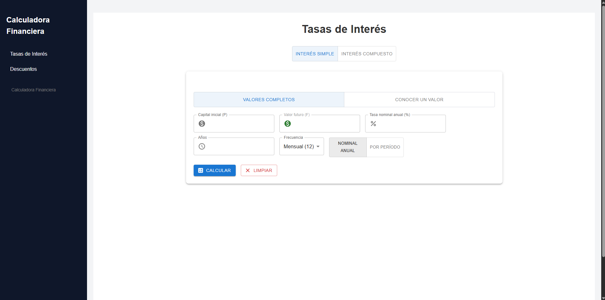
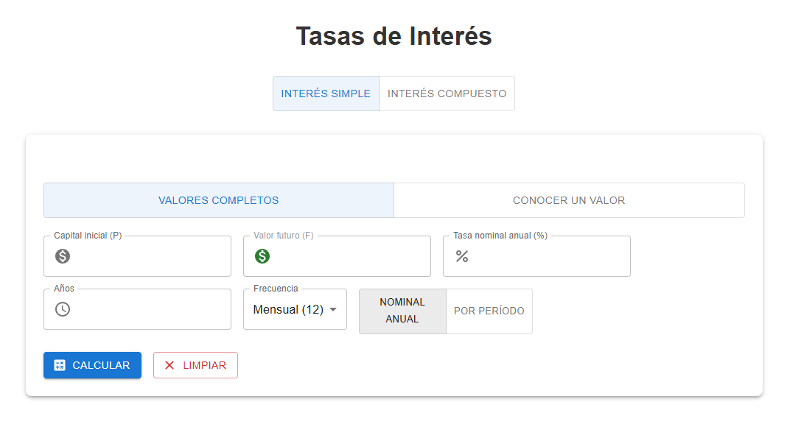
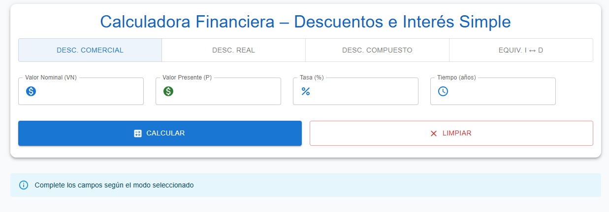

# Calculadora Financiera en React

Aplicación web interactiva para cálculos de **interés simple**, **interés compuesto** y **descuentos** (comercial, real, compuesto y equivalencia de tasas).



## Tecnologías utilizadas

- React 18 + Vite
- Material-UI (@mui/material + @mui/icons-material)
- CSS plano 

## Instalación paso a paso

```bash
# 1. Crear el proyecto con Vite + React
npx create-vite@latest calculadora-financiera -- --template react

# 2. Entrar a la carpeta del proyecto
cd calculadora-financiera

# 3. Instalar dependencias base de React/Vite
npm install

# 4. Instalar Material-UI (componentes visuales: tarjetas, botones, toggles, inputs)
npm install @mui/material @emotion/react @emotion/styled

# 5. Instalar los iconos de Material-UI (dinero 💰, porcentaje %, reloj ⏰, etc.)
npm install @mui/icons-material

# 6. Iniciar la aplicación en modo desarrollo
npm run dev


calculadora-financiera/
├── src/
│   ├── components/
│   │   ├── Sidebar.jsx          # Menú lateral
│   │   ├── Tasas.jsx            # Contenedor de tasas (elige simple/compuesto)
│   │   ├── TasasSimple.jsx      # Cálculos de interés simple
│   │   ├── TasasCompuestas.jsx  # Cálculos de interés compuesto
│   │   └── Descuentos.jsx       # Todos los tipos de descuento
│   ├── App.jsx                  # Componente principal + estado global
│   └── App.css                  # Estilos generales
├── public/                      # Archivos estáticos
└── docs/
    └── imagenes/                # Capturas de pantalla para documentación

    Vista rápida de los módulos

Sidebar: Menú lateral para navegar
Tasas de Interés: Interés simple y compuesto con múltiples incógnitas
Descuentos: Descuento comercial, real, compuesto y equivalencia i ↔ d


